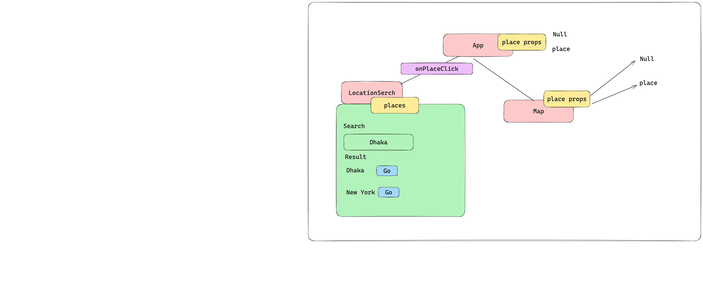

# Google Map Implementation 

[Open Source API](https://nominatim.org/release-docs/develop/api/Search/)
- Try to remember the type 
```typescript
 const handleSubmit =async(event:React.FormEvent<HTMLFormElement>)=>{
    event.preventDefault();
  };
```
- To show and fly way to google map

         npm install @types/leaflet leaflet react-leaflet

## Output


- Architecture:

