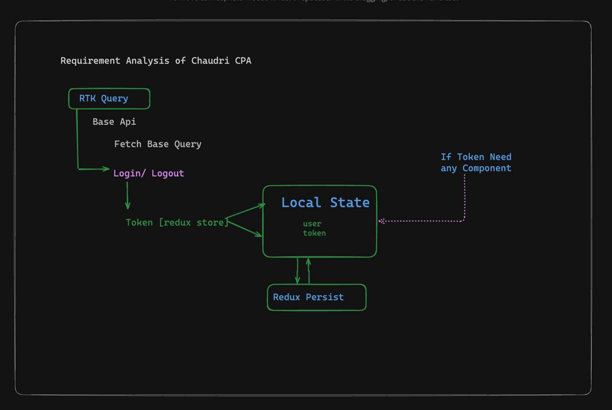

# Chaudry CPA
 
##    [👉  Live Link](https://chaudry-cpa.vercel.app)

## 🚀 Getting Started

First Clone the repository

    https://github.com/bappasahabapi/chaudry-cpa.git

Then, Install the dependencies by giving the command 

    npm install

Finally, Run the Project by giving

    npm run dev

## 📐 Architecture



###    🎯  Functionality Implemented</summary>

NB: **Given more time, small functionalities could be implemented to enhance scalability and reusability..**

- **Implement the code and folder structure to support** further customization and extendability.

- Used `Next.js`  with `TypeScript` as the framework
- `Tailwind Css ` for styling
- Utilized `Redux` for state management.
-  Created a `responsive` and `visually` appealing `login form` using Tailwind CSS.
- Follow best coding standards throughout included (SOLID and DRY)
- Hosted the project on `Vercel`.

- Both **Login and Logout**  fuctionalities are implemented:
    - Implemented `email and password validation`
    - implemented `token based authentication`
    - Implemented` redirect to homePage if valid credentials`
    - Implemented Login Persistence 
    - Implemented Validation For each Input
    - Make `Reusable` and and `HyBride Component Code Structure` like [Enterprise Level]
    - Implemented `Debouncing Concept`

- **Additionally**
    - Add `Sonner` for Notification
    - Add redux hook form for more validation and customization     


<details>
<summary>🎯   Task Description</summary>

- Implementation Details
    - For this task, please implement the `login functionality only`.

- Login Page Expectations
    - Create a responsive and visually appealing login form using Tailwind CSS.
    - Manage API responses and token storage using Redux.
    - Provide proper error handling and form validation.


- API Endpoint:
    - POST https://api.zsimarketing.com/api/auth/user/login
    
Request Body:

```json
{
    "email": "testuser@gmail.com",
    "password": "testuser@gmail.com"
}
Response Format:

```json
{
    "data": {
        "token": "",
        "user": {
            "email": "testuser@gmail.com",
            "name": "Test User",
            "category": null,
            "email_verified": false
        }
    },
    "isError": false,
    "error": null,
    "status_code": 200
}


```

 

</details>
:

## 🥡 Used packages and commands

- `npx create-next-app@14` 
- `npm install @reduxjs/toolkit react-redux` 
- `npm install react-icons` | make the Ui more realistic thats why
- `npm install react-hook-form` | just make for better performance and reusabilitu
- `npm install jwt-decode` | if user data will decode from token in future than I will use 
- `npm i redux-persist` | For Persis user login
- `npm install sonner` | For showing toast


