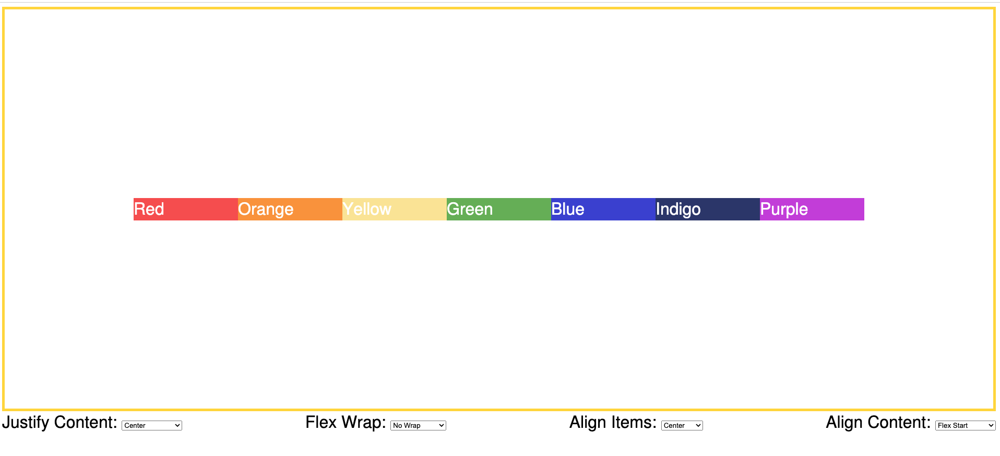
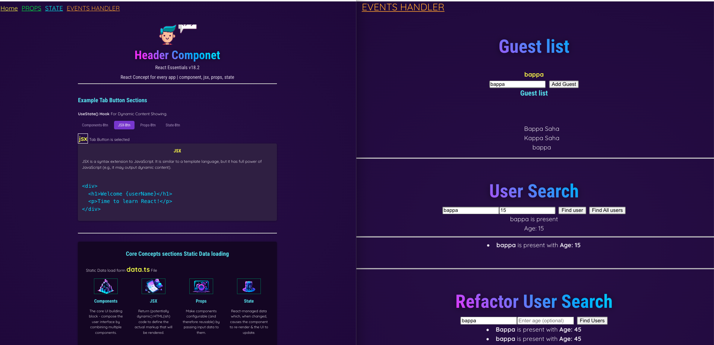
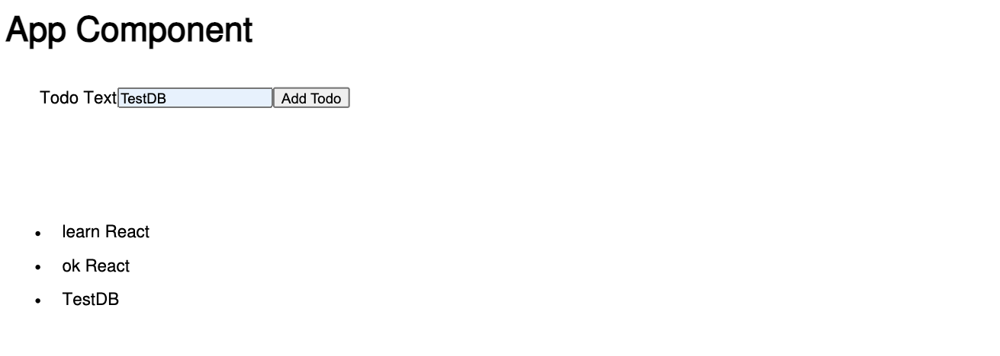
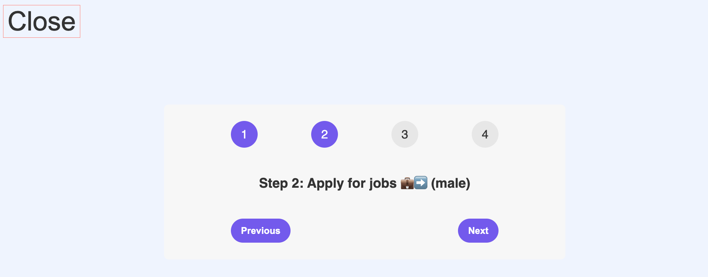
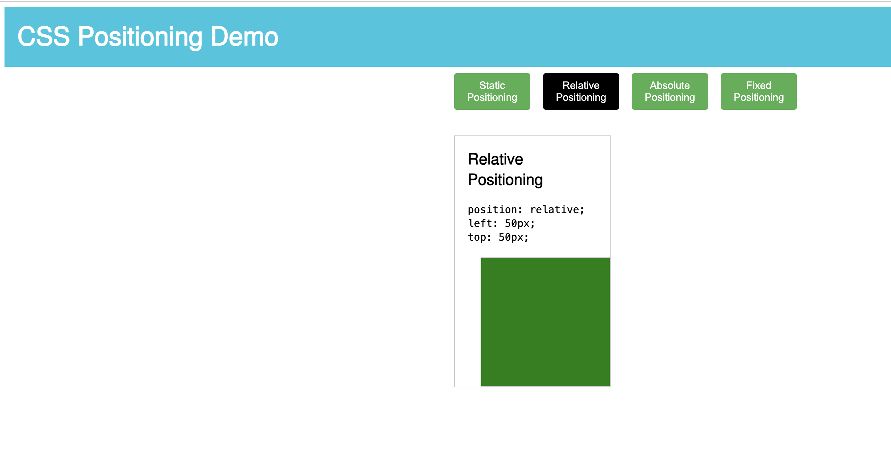

# Vite React TypeScript Features Projects:
- All Rights Reserved to [bappasaha.com](https://bappasaha.vercel.app/)

##    Main Folders

- [0-A-Redux-Works](https://github.com/bappasahabapi/vite-react-typescript-2025/tree/main/0-A-Redux-Works)
- [0-B-Vite-JavaScript-Works](https://github.com/bappasahabapi/vite-react-typescript-2025/tree/main/0-B-Vite-JavaScript-Works)
- [0-C-Vite-TypeScript-Works](https://github.com/bappasahabapi/vite-react-typescript-2025/tree/main/0-C-Vite-TypeScript-Works)
- [0-D-Nextjs-Works](https://github.com/bappasahabapi/vite-react-typescript-2025/tree/main/0-D-Nextjs-Works)
- [0-E-CSS-Works](https://github.com/bappasahabapi/vite-react-typescript-2025/tree/main/0-E-CSS-Works)

## 📗 Run the project
<details>
  <summary> 🔥 Project Setup Instructions</summary>

  1. Clone the repository:
     ```bash
     git clone https://github.com/bappasahabapi/vite-react-typescript-2025.git
     ```

  2. Go to the folder
     ```bash
     cd forder_name
     ```

  3. Install dependencies:
     ```bash
     npm install
     ```
  3. Start the development server:
     ```bash
     npm run dev
     ```

  You can find additional setup instructions [here](https://example.com/docs).

</details>

- `cd 03-Google-Map`
- `npm install`
- `npm run dev`

## TypeScript state props event types

<details>
  <summary>Project Setup Instructions</summary>

- onSearch Types:

    ```typescript
    type SearchProps ={
    onSearch:(searchTerm:string)=>void;
    }
    
    const SearchTask = ({onSearch}:SearchProps) => {
    const [searchTerm, setSearchTerm] = useState<string>("");
    
    ```
- props Types:

```typescript

interface TaskListProps {
  tasks: DefaultTask[];
  onFavourite: (id: string) => void;
  onDelete: (id: string) => void;
  onEdit: (task: DefaultTask) => void;
}

const TaskList = ({ tasks, onFavourite, onDelete, onEdit }: TaskListProps) => {}

interface TaskActionsProps {
    onClick: () => void; // Type for onClick prop
    onDeleteAll: () => void; 
}


export default function TaskActions({onClick,onDeleteAll}:TaskActionsProps) {}

type SearchProps ={
    onSearch:(searchTerm:string)=>void;
}

const SearchTask = ({onSearch}:SearchProps) => {}

    
    ```

- handleChange Types:

```typescript

         const handleChange = (
        event: React.ChangeEvent<
          HTMLInputElement | HTMLTextAreaElement | HTMLSelectElement
        >
      ) => {
        const { name, value } = event.target;
        const updatedValue = name === "tags" ? value.split(",") : value;
        setTask({
          ...task,
          [name]: updatedValue,
        });
      };
    
      const handleSubmit = (event: React.FormEvent<HTMLFormElement>) => {
        event.preventDefault(); // Prevent default form submission behavior
        onSave(task,isAdd); // Call onSave with the current task
      };

  const handleEdit = (editTask: DefaultTask) => {
    console.log(editTask);
    setTaskToUpdate(editTask);
    setShowAddModal(true);
  };

  const handleFavourite = (taskId: string) => {
    // const taskIndex =tasks.findIndex(task=>{ console.log(task.id, taskId) ; return task.id ===taskId});
    const taskIndex = tasks.findIndex((task) => task.id === taskId);
    const previousTask = [...tasks];

    previousTask[taskIndex].isFavorite = !previousTask[taskIndex].isFavorite;
    setTasks(previousTask);
  };

  const handleDelete = (taskId: string) => {
    console.log(taskId);
    const filterTasks = tasks.filter((task) => task.id !== taskId);
    setTasks(filterTasks);
  };

  const handleDeleteAll = () => {
    tasks.length = 0;
    setTasks([...tasks]);
  };

  const handleOnSearch = (serchText: string) => {
    console.log(serchText);

    const filterTasks = tasks.filter(
      (task) =>
        task.title.toLocaleLowerCase().includes(serchText) ||
        task.description.toLocaleLowerCase().includes(serchText) ||
        task.priority.toLocaleLowerCase().includes(serchText)
    );

    setTasks([...filterTasks])
  };


 Separate function to handle editing an existing task
  const handleAddTask = (newTask: DefaultTask) => {
    setTasks([...tasks, newTask]);
    setShowAddModal(false);
  };

 Separate function to handle editing an existing task
  const handleUpdateTask = (updatedTask: DefaultTask) => {
    const updatedTasks = tasks.map((task) =>
      task.id === updatedTask.id ? updatedTask : task
    );
    setTasks(updatedTasks);
    setShowAddModal(false);
    setTaskToUpdate(null);
  };
        
```


</details>

## 


## 📗 Features:

- [01-Css Flexbox]()
- [02-Google Map]()
- [03-React-Basic-Max]
- [04-React-TypeScript-Todo]()
- [05-Stepper]()
- [06-Tasker]()


## 📗 Output Images


-    **01-Css Flexbox Playground**
<details>
  <summary>Working Functionality</summary>

-  Very good use of UseState() hook.
- Dynamic Style added 

  
  
</details>



-    **02-Google Map Integration Feature**


-    **03-React-Basic-Max**


-    **04-React-Typescript-Todo-Max**


-    **05-Stepper-jonas**


-    **06-Css Positioning Playground**

<details>
  <summary>Working Functionality</summary>

-  Very good use of UseState() hook.
- Dynamic Style added 

  
  
</details>



-    **06-Tasker+Book-Search-Filter** [live](https://improved-tasker-phi.vercel.app/)

<details>
  <summary>Working Functionality</summary>

-  Passing data from parent to child as props
-  Passing function props from child to parent as props
- Lifting State up desing pattern added
- CRUD is done using useState
- Search Functionality Added based on title priority description
  
  
</details>


